

# **ProyectoFinalCGIH05-Manual de Usuario**

### **Autor** :
 - Amaro Cantoral Edgar
 - Cta: 316625368

  
#### **Semestre 2023-1 | Grupo 05**

### **Requerimentos**

* Para ejecución con Visual Studio 2019 con instalación de C++ o con el ejecutable .exe:
    - Windows 7 (Última actualización), Windows 8 (2919355), Windows 10 (version 1703 o superior)
    - Procesador: 1.8 GHz (recomendado 4 núcleos o más)
    - 2.5 GB RAM mínimo, 8 GB recomendado
    - 2 GB en disco, recomendado
    - Chip gráfico de mínimo 720p de resolución

### **Apertura y ejecución del proyecto**

Descargar el proyecto desde GitHub dando click al boton verde "Code" y seleccionando una de las opciones

    </img>

 
Si selecciona "Open with GitHub Desktop" requiere tener esta aplicación instalada en su equipo y seguir los pasos para clonar el repositorio de manera local, una vez 
clonado saltar hasta ["Ejecución el archivo .exe"](#item1).

La selección "Download ZIP" descargará un archivo .zip del proyecto, habrá que descomprimirlo en su equipo, regresar a este manual y saltarse hasta ["Ejecución el archivo .exe"](#item1).

Una vez descargado y descomprimido el proyecto en su equipo, deberá descomprimir 3 archivos importantes en su equipo debido a que en el repositorio está limitada la cantidad de alamcenamiento de datos. Las siguientes rutas en donde descomprimirá estos archivos con las siguientes:

CGIH_prueba1/lib

    </img>

 

CGIH_prueba1/resources/objects/FurnitureBath

    </img>

 ### ***Ejecución con Visual Studio*** 
 
 Si se desea y tiene instalado el IDE Visual Studio puede ejecutar la aplicación siguiendo los siguientes pasos.
 Tener descargado el proyecto de git-hub y haber descomprimdo la carpeta zip. Una vez teniendo esto abrir Visual Studio y seleccionar la opción "Abrir un proyecto o una solución"
 
  

  </img>

 
Buscar el archivo "CGIH_prueba1.sln" dentro de la carpeta descomprimida y dar en el botón de abrir. 

    </img>

Antes de ejectutar el programa comprobamos que todas las bibliotecas y configuraciones esten cargadas correctamente. Nos dirigimos al explorador de soluciones, hacemos click derecho en el nombre del proyecto y seleccionamos la opción de propiedades.

    </img>

En el apartado de "General" verificamos que el Conjunto de herramienras de la plataforma sea uno que tengamos descargado puede ser v142 o v143.

    </img>

 
 Dentro de C/C++ -> Gneral verificar que la palabra include se encuentra en directorios de inclusión adicionales. En el Vincluador -> General la palabra lib en Directorios de bibliotecas adicionales.
 

    </img>

    </img>

Finalmente, en Vinculador -> Entrada verificar que las dependencias se encuentren ahí: SDL2.lib;SDL2main.lib;assimp-vc141-mtd.lib;opengl32.lib;glew32.lib;glfw3.lib;kernel32.lib;user32.lib;gdi32.lib;winspool.lib;comdlg32.lib;advapi32.lib;shell32.lib;ole32.lib;oleaut32.lib;uuid.lib;odbc32.lib;odbccp32.lib;%(AdditionalDependencies)

Si ya se encuentran todas las dependencias, presionar "Aceptar"

    </img>

Para poner en ejecución el proyecto se debe seleccionar la opción "x86" en la barra superior y verificar que esté seleccionada la opción "Debug" como se muestra en la siguiente imagen.
 

    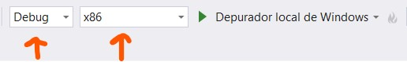</img>

 
 
Ya puede ejecutarse el proyecto dando click en el boton "Depurador local de Windows", esto abrirá la ventana del programa. 
 

    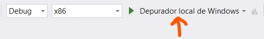</img>

 
### ***Ejecución con archivo .exe***
 
Una vez clonado el proyecto o descomprimido el ZIP: abrir la carpeta generada o ubicación del repositorio en su equipo y dirigirse a "\ProyectoFinalCGIH05\Ejecutable", descomprimir el archivo "CGIH_prueba1.pdb", ubicar el archivo "CGIH_prueba1.exe" y dar doble click para abrir. Lo anterior abrirá una ventana con el espacio virtual ejecutandose.
 

    </img>

 

    </img>

 
 
### ***Interacción con el ambiente*** 
 
Una vez abierta la ventana; estando dentro del espacio virtual se captura el mouse para funcionar unicamente dentro de este, por lo que no se observa el cursos y el movimiento del mouse solo funciona dentro de la ventana. La interacción se da mediante el teclado y mouse de la computadora.
 
Vista del ejecutable, modelo de la casa con coche lamborghini y personaje Stewie 

    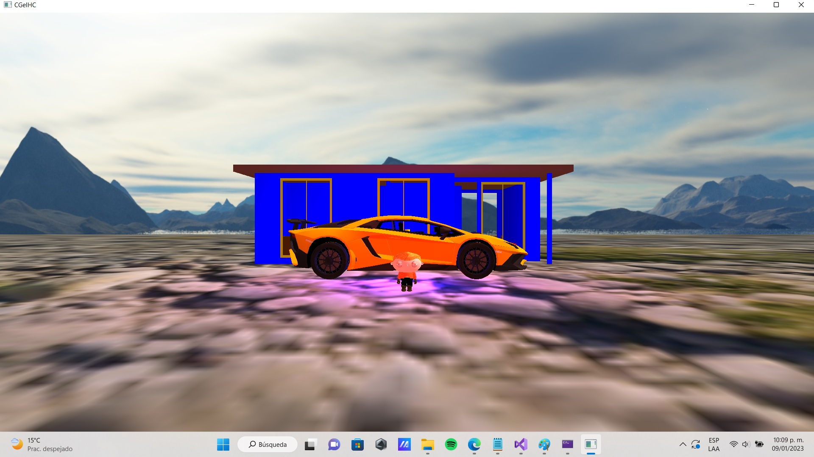</img>

  
 
Dormitorio 1

    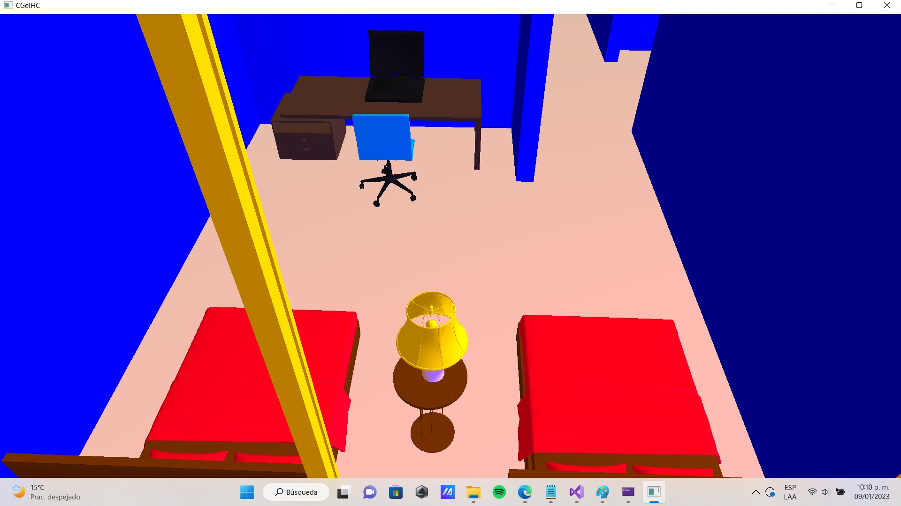</img>

 

Dormitorio 2

    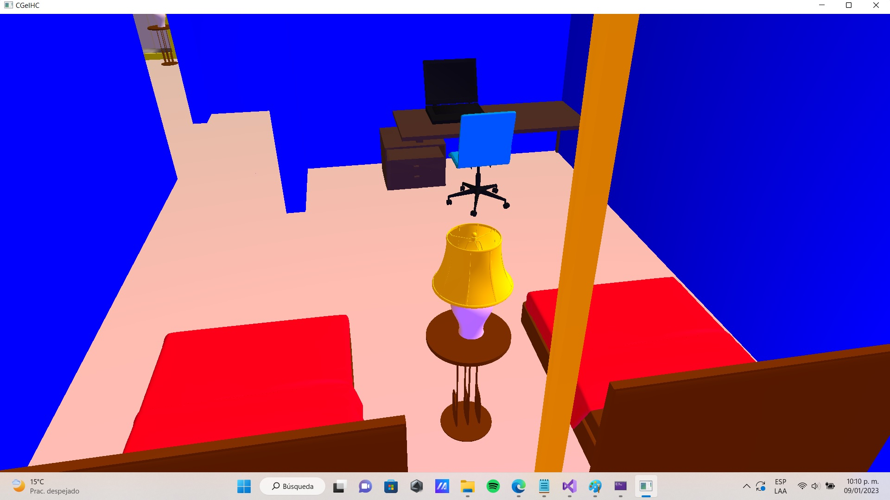</img>

 

Dormitorio 3

    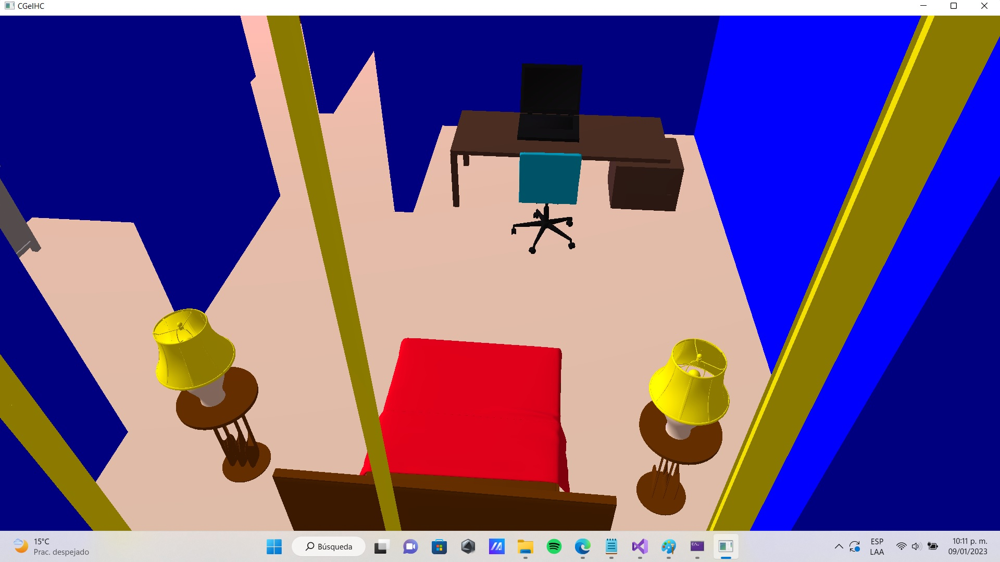</img>

 

Baño 1

    </img>

 
 
Baño 2

    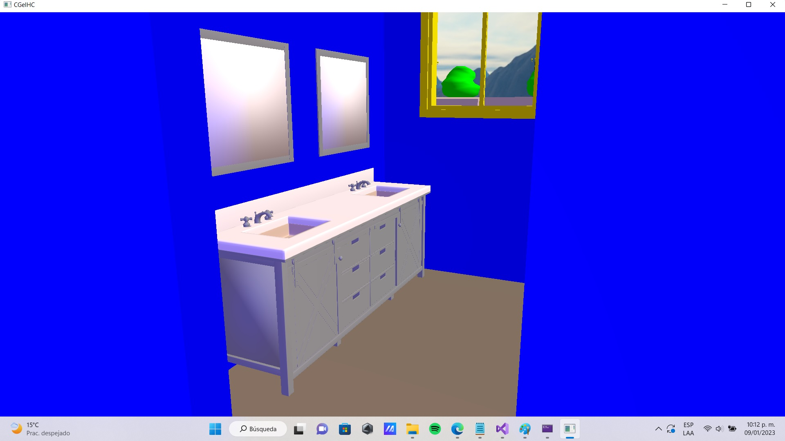</img>

 

Sala

    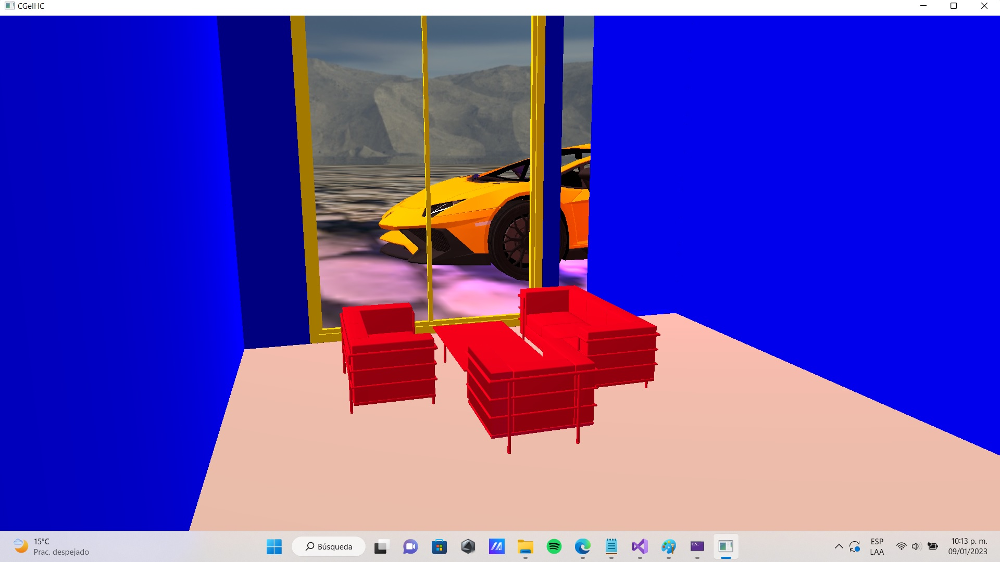</img>

 
Cocina

    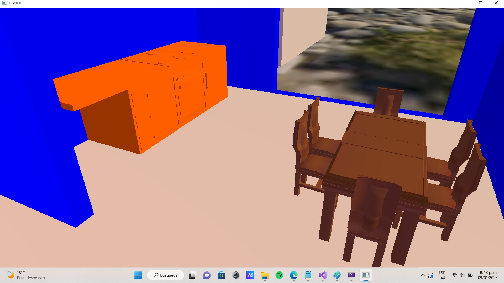</img>

 
 
Piscina con jardín

    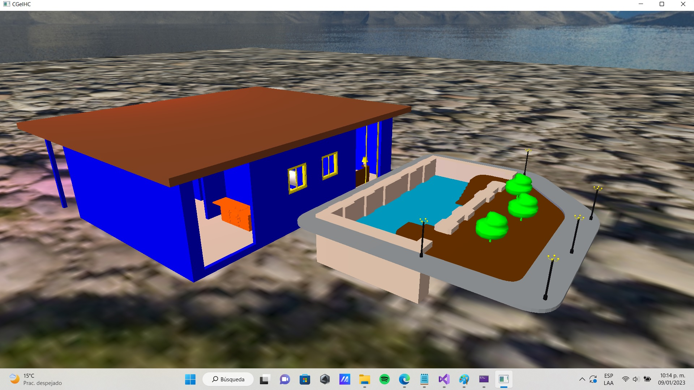</img>

 

### **Funciones**
* ***Teclado***:
    * "Esc" : para salir de la ventana / terminar el programa. ❌
    
    Simulación de las teclas de adelante ⬆️, atrás ⬇️, izquierda ⬅️, derecha ➡️ para movimiento como sucede en los videojuegos
    * "W" : mover la cámara hacia enfrente ⬆️. 
    * "S" : mover la cámara hacia atrás ⬇️. 
    * "A" : mover la cámara hacia la izquierda ⬅️.
    * "D" : mover la cámara hacia la derecha ➡️.

 ### **Animaciones**

 * "SPACE" : activar o desactivar la animacion del vehiculo 🚗.
 

    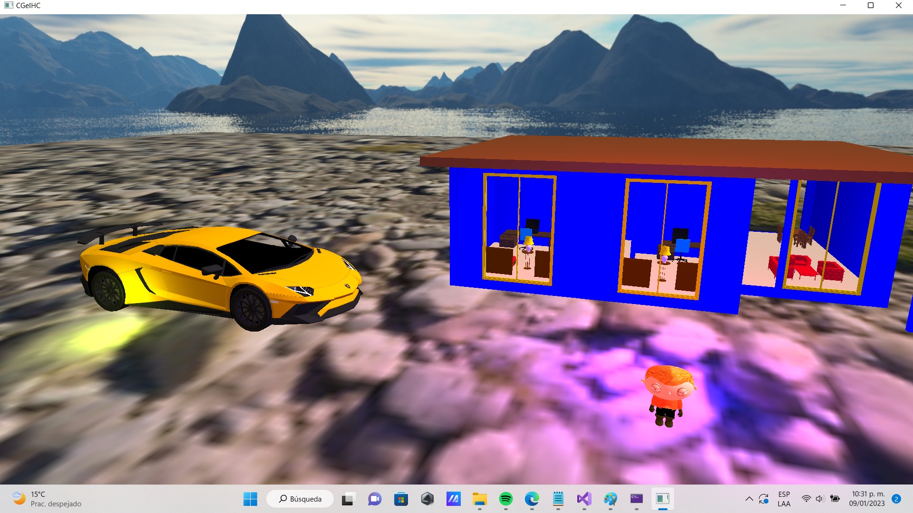</img>

 
