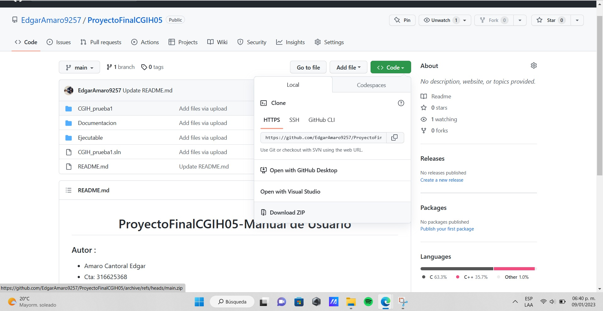

# **ProyectoFinalCGIH05-Manual de Usuario**

### **Autor** :
 - Amaro Cantoral Edgar
 - Cta: 316625368

  
#### **Semestre 2023-1 | Grupo 05**

### **Requerimentos**

* Para ejecución con Visual Studio 2019 con instalación de C++ o con el ejecutable .exe:
    - Windows 7 (Última actualización), Windows 8 (2919355), Windows 10 (version 1703 o superior)
    - Procesador: 1.8 GHz (recomendado 4 núcleos o más)
    - 2.5 GB RAM mínimo, 8 GB recomendado
    - 2 GB en disco, recomendado
    - Chip gráfico de mínimo 720p de resolución

### **Apertura y ejecución del proyecto**

Descargar el proyecto desde GitHub dando click al boton verde "Code" y seleccionando una de las opciones

    </img>

 
Si selecciona "Open with GitHub Desktop" requiere tener esta aplicación instalada en su equipo y seguir los pasos para clonar el repositorio de manera local, una vez 
clonado saltar hasta ["Ejecución el archivo .exe"](#item1).

La selección "Download ZIP" descargará un archivo .zip del proyecto, habrá que descomprimirlo en su equipo, regresar a este manual y saltarse hasta ["Ejecución el archivo .exe"](#item1).

 ### ***Ejecución con Visual Studio*** 
 
 Si se desea y tiene instalado el IDE Visual Studio puede ejecutar la aplicación siguiendo los siguientes pasos.
 Tener descargado el proyecto de git-hub y haber descomprimdo la carpeta zip. Una vez teniendo esto abrir Visual Studio y seleccionar la opción "Abrir un proyecto o una solución"
